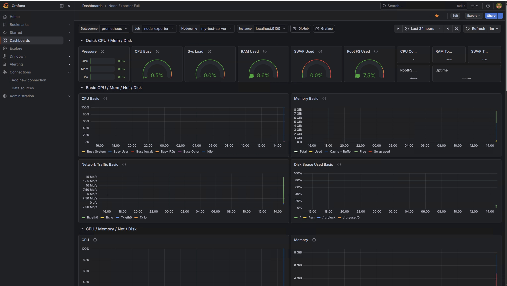
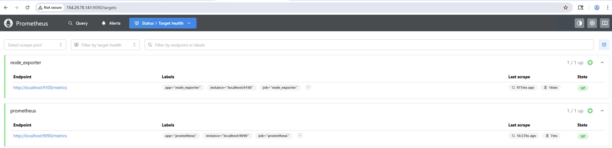
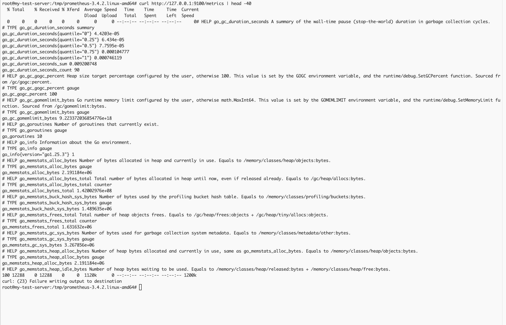
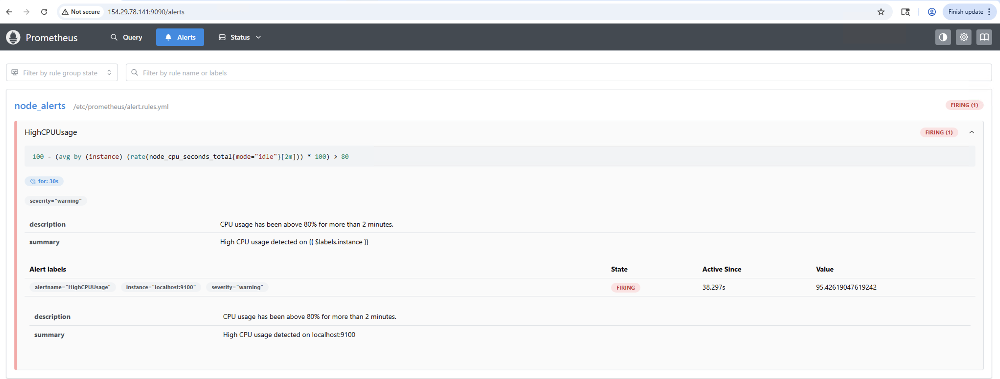
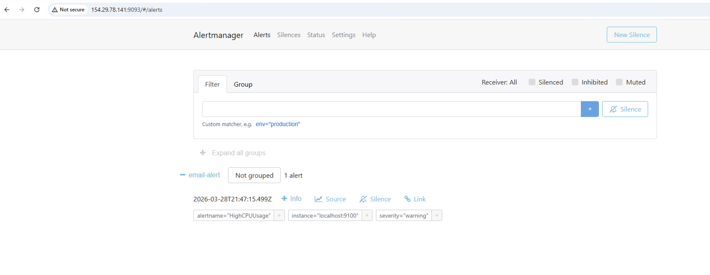

# SRE Monitoring Stack

A practical Linux monitoring stack built with Prometheus, Grafana, Node Exporter, and Ansible.

## Overview
This project demonstrates how to deploy a simple observability stack for Linux servers. It includes metrics collection, visualization, and infrastructure automation.

## Tools Used
- Prometheus
- Grafana
- Node Exporter
- Ansible
- Ubuntu Linux

## Features
- Collects CPU, memory, disk, load, and network metrics
- Scrapes metrics with Prometheus
- Visualizes metrics using Grafana dashboards
- Uses Node Exporter for Linux system metrics
- Structured for automated deployment with Ansible

## Project Structure
- `install_monitoring.yml` - main Ansible playbook
- `inventory.ini` - target host inventory
- `group_vars/all.yml` - shared variables
- `roles/` - Ansible roles for Prometheus, Node Exporter, and Grafana
- `screenshots/` - proof of working setup

## Screenshots

### Grafana Dashboard

### Prometheus Targets

### Node Exporter Metrics

## Skills Demonstrated
- Linux systems administration
- Monitoring and observability
- Prometheus configuration
- Grafana dashboards
- Infrastructure automation with Ansible
- Service management with systemd

## Next Improvements
- Add Alertmanager
- Add email alerting
- Monitor a second server
- Add Blackbox Exporter
- Automate full deployment end-to-end

  ## Alerting

- Configured Prometheus alert rules for CPU usage
- Integrated Alertmanager for alert processing
- Triggered alerts using stress-ng to simulate high CPU load
- Verified alert flow from Prometheus → Alertmanager

### Alert Example

