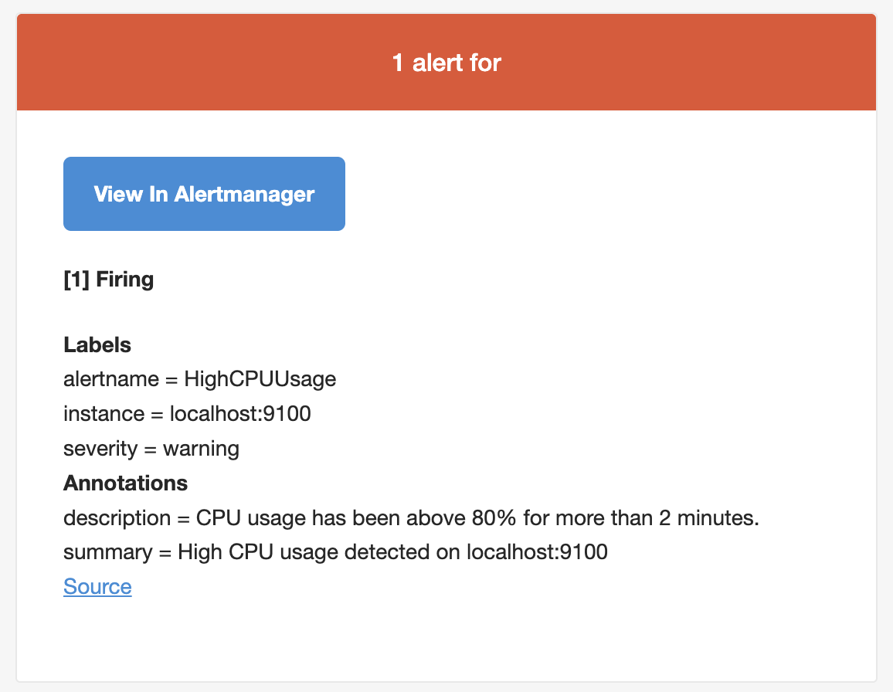

# 🚀 SRE Monitoring Stack (Prometheus + Alertmanager + Grafana)

**Built as part of hands-on SRE practice to simulate real-world monitoring and incident response.**

---

## 📌 Overview

This project demonstrates a complete end-to-end monitoring and alerting system using Prometheus, Alertmanager, and Grafana.

The setup monitors multiple nodes (Linux server + MacBook), generates alerts based on system metrics, and delivers notifications via email.

---

## 🧱 Architecture

MacBook (node_exporter)
  ↓ (via ngrok tunnel)
Linux Server (Prometheus)
  ↓
Alertmanager
  ↓
Email Notifications (Gmail SMTP)
  ↓
Grafana Dashboards

---

## ⚙️ Tech Stack

* Prometheus (metrics collection)
* Alertmanager (alert routing)
* Grafana (visualization)
* Node Exporter (system metrics)
* ngrok (secure tunnel for remote node)
* stress (CPU load testing)
* Ansible (automation & deployment)

---

## 🔍 Features

* Multi-node monitoring (Linux + macOS)
* Real-time CPU, Memory, Disk, Network metrics
* Alerting for high CPU usage
* Email notifications via SMTP
* Grafana dashboards for visualization
* Remote node monitoring using ngrok
* Infrastructure automation using Ansible

---

## 🚨 Alert Rule Example

```promql
100 - (avg by (instance) (rate(node_cpu_seconds_total{mode="idle"}[2m])) * 100) > 80
```

* Triggers when CPU usage exceeds 80%
* Alert duration: 30 seconds

---

## 🧪 Testing (Failure Simulation)

CPU load was simulated using:

```bash
stress --cpu 2 --timeout 300
```

This triggered alerts across:

* Prometheus
* Alertmanager
* Email notifications

---

## 📸 Screenshots

### Prometheus Targets


### Prometheus Alert (Firing)


### Alertmanager Alert


### Email Notification



### Grafana Dashboard


---

## 🧠 Skills Demonstrated

* Linux system administration
* Monitoring & observability (Prometheus ecosystem)
* Alerting & incident response
* Metrics-based troubleshooting
* Infrastructure automation (Ansible)
* Service management (systemd)
* Real-world failure simulation

---

## 🚀 Future Improvements

* Add Memory & Disk alerts
* Slack / PagerDuty integration
* Dockerize entire stack
* Kubernetes deployment
* Blackbox exporter (uptime monitoring)

---

## 👨‍💻 Author

Nilesh Aher
